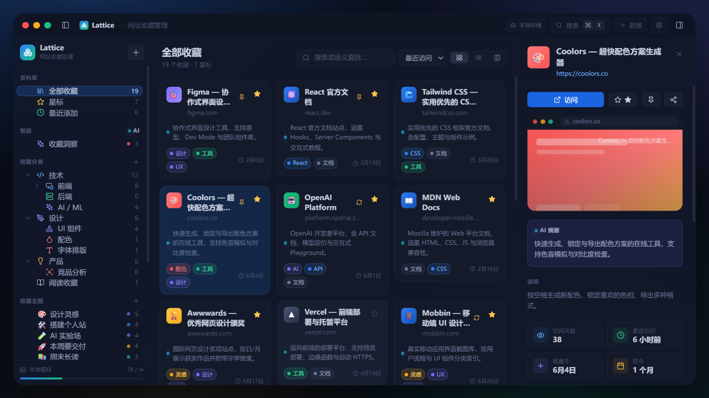
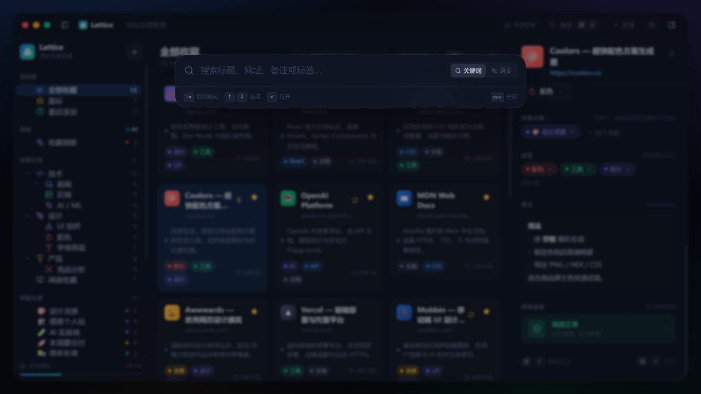
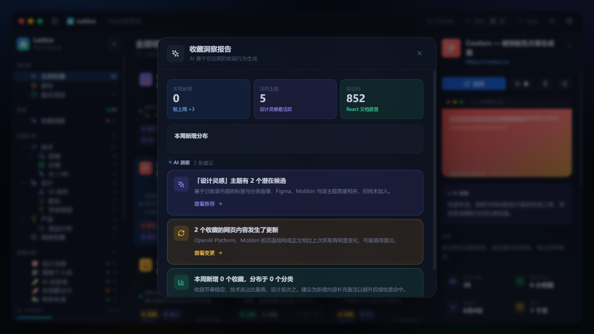
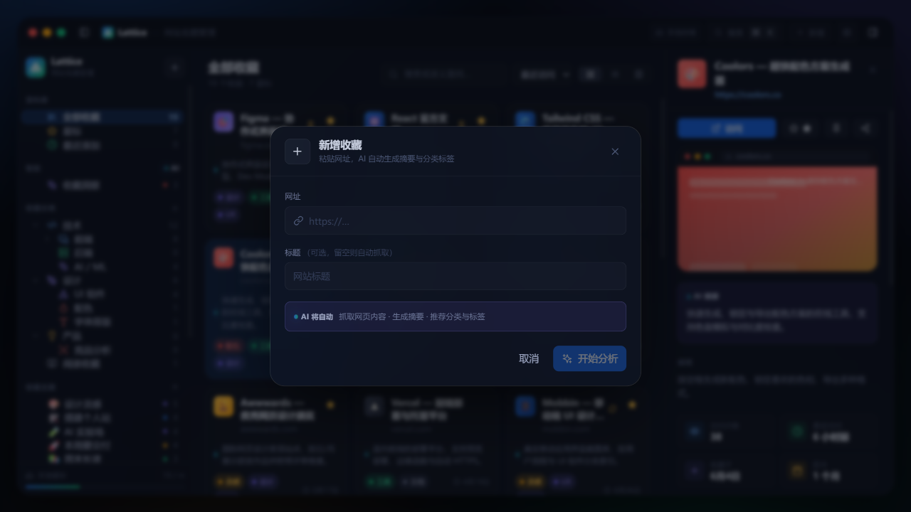
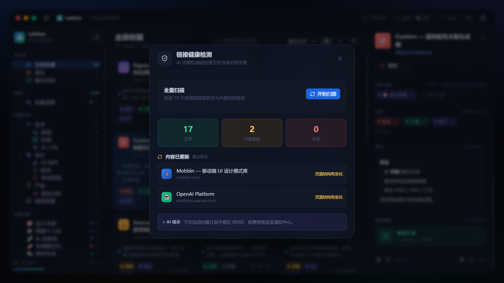
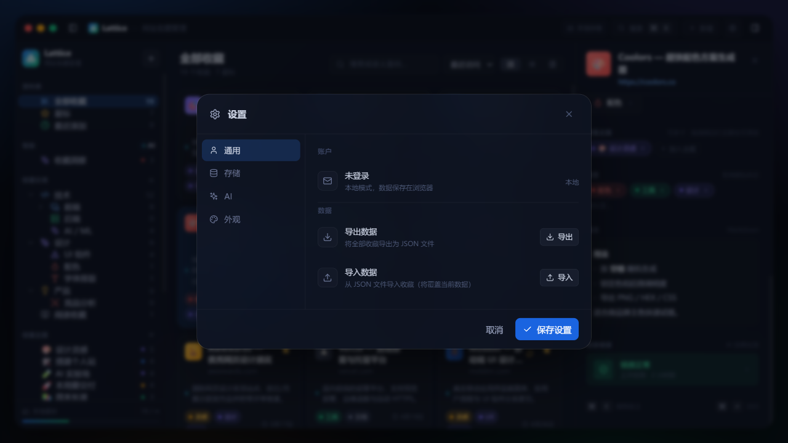

# Linkit - Smart Knowledge Curation Space

<p align="center">
  
</p>

<p align="center">
  <b>English</b> | <a href="README.zh-CN.md">简体中文</a>
</p>

---

**Linkit** is a desktop "Smart Knowledge Curation Space" designed to help you collect, organize, discover, and reuse web links, page resources, and creative inspirations. Unlike traditional browser bookmark managers, Linkit focuses on long-term organization using categories, flexible cross-category compilation using collections, and AI-powered understanding, connection, and cataloging.

### 🌟 Key Features

- **💡 Knowledge Assets over Link Lists**: Organize links with rich metadata, including custom tags, star ratings, pinning, notes, and reading status (`unread`, `reading`, `read`, `archived`).
- **📁 Multi-Level Categories**: A stable structure featuring drag-and-drop category tree organization and instant drag-to-categorize bookmarks.
- **🎨 Dynamic Collections**: Create cross-category themed spaces with customizable emojis and colors. You can drag bookmarks to group them, or ask AI to auto-curate collections based on a specific prompt.
- **🤖 Built-in AI Copilot**: Fully-integrated local/remote LLM support for page analysis, auto-summarization, smart tag recommendations, target-oriented collection creation, duplicate detection, and semantic search.
- **🔍 Spotlight Search**: Open instantly with `Cmd/Ctrl + K` to search through titles, descriptions, notes, and semantic contents, or quick-save URLs from the clipboard.
- **🛡️ Secure Storage Modes**: Run fully locally in offline-first mode, or log in to sync your library across devices with Supabase Cloud. Rest assured that all cloud data is protected by Row-Level Security (RLS).
- **❤️ Link Health & Insights**: Semi-automated background scans check for broken or changed links, and the automated "Insights Report" summarizes curation statistics and content patterns.
- **🌐 Static Knowledge Graphs**: Explore how your bookmarks connect visually via shared tags, collections, and semantic relationships in a local interactive network graph.

---

### 📸 Interface Showcase

#### 📊 Main Workspace (Dashboard)
A modern three-column layout featuring collapsible sidebars, multiple grid/list view controls, and a detailed curation sidebar.


#### 🔍 Spotlight Search (`Cmd/Ctrl + K`)
Instantly search titles, notes, and semantic embeddings, or paste a URL to quickly save it to Linkit.


#### 🤖 AI Insights & Smart Summaries
Get automated reading summaries, semantic tag suggestions, and key takeaways for each bookmark.


#### 📥 Adding Bookmarks & Quick Capture
Capture links instantly with drag-and-drop or clipboard detection. AI analyzes and categorizes them automatically.


#### 💔 Link Health Check
Scan for updated or broken links and filter results easily.


#### ⚙️ Custom Preferences & Appearance
Support for multiple elegant themes (*Midnight*, *Ocean*, *Graphite*, *Sunset*) and full localization (English/简体中文).


---

### 🛠️ Technology Stack

- **Desktop Framework**: [Wails](https://wails.io/) (Go / Golang)
- **Frontend Core**: [React](https://react.dev/) + [Vite](https://vite.dev/) + [TypeScript](https://www.typescriptlang.org/)
- **UI & Styling**: [Tailwind CSS](https://tailwindcss.com/) + Custom Glassmorphism Theme
- **Database & Sync**: [Supabase](https://supabase.com/) (PostgreSQL with Row-Level Security)
- **State & Routing**: React Context + Custom Hooks
- **AI Engine**: Local LLM APIs or Remote OpenAI/DeepSeek compatible API endpoints

---

### 🚀 Quick Start

#### Prerequisites
- [Go](https://go.dev/) (v1.26.0+ recommended)
- [Node.js](https://nodejs.org/) (v18+) & [pnpm](https://pnpm.io/)
- [Wails CLI](https://wails.io/docs/gettingstarted/installation) (v2.13.0+)

#### 1. Clone & Install Dependencies
```bash
git clone <repository-url>
cd collection
pnpm --prefix ui install --frozen-lockfile
```

#### 2. Configure Environment Variables
Copy `.env.test.example` to `.env` (or configure your Supabase backend / local API keys in the app settings):
```bash
cp ui/.env.test.example ui/.env
```

#### 3. Start Development Mode
Run Wails development environment:
```bash
wails dev
```
This boots up the desktop application shell and monitors both frontend and backend changes.
*Alternatively, you can run the React frontend prototype independently:*
```bash
cd ui && pnpm dev
```
Open `http://localhost:5173/` in your browser.

#### 4. Build Production Application
Compile the frontend assets and compile the native binary into `build/bin/`:
```bash
wails build
```

---

### 🔑 Security & Configuration
- **Supabase RLS**: All remote data interactions are secured by row-level policies. Users can only access their own records.
- **AI Credentials**: API base and API keys are stored securely using system keystores (`go-keyring`) and local app preferences. No credentials are ever hardcoded or sent to third-party tracking services.
