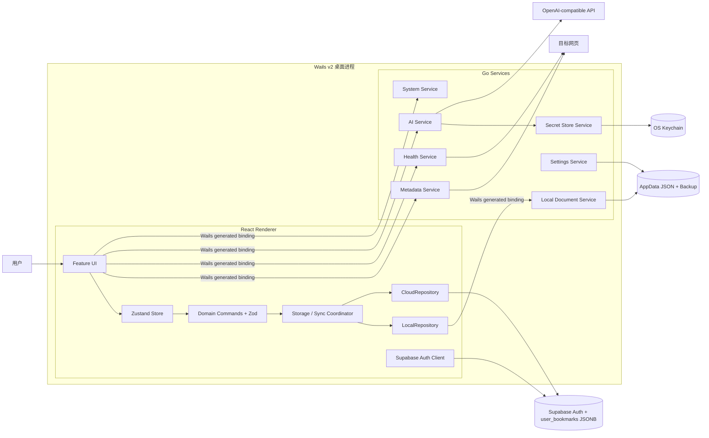
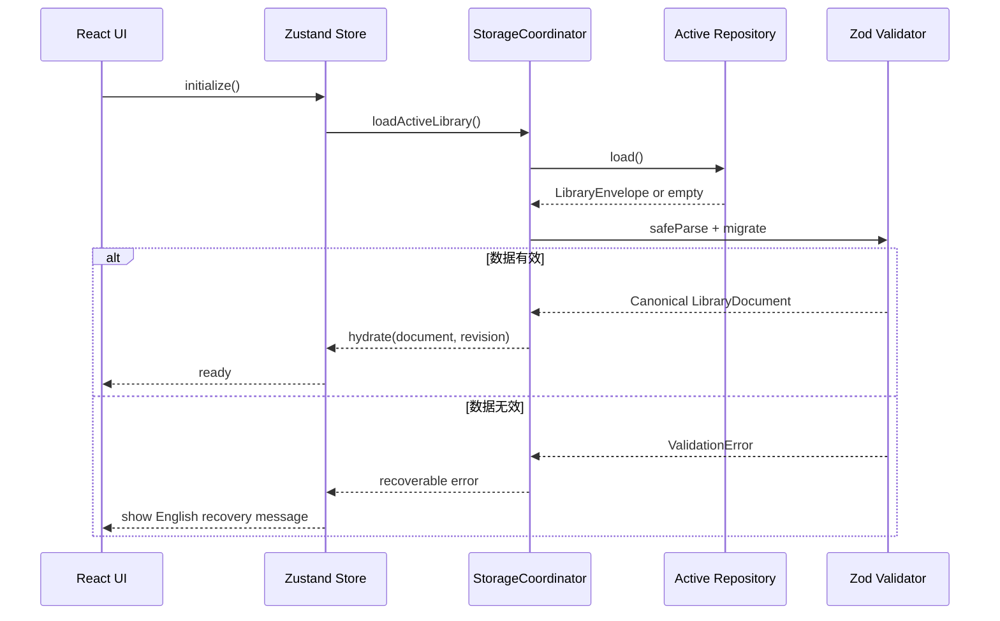
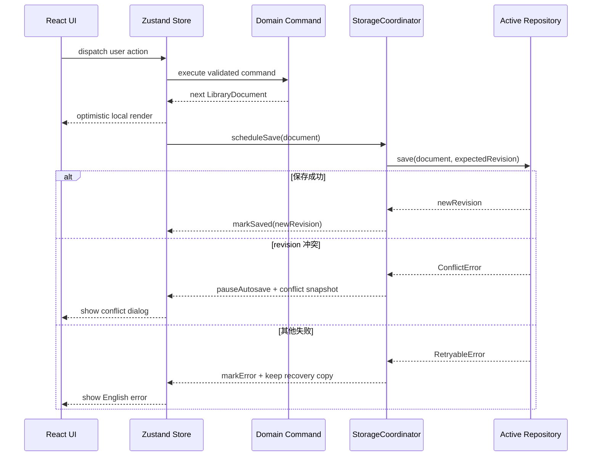
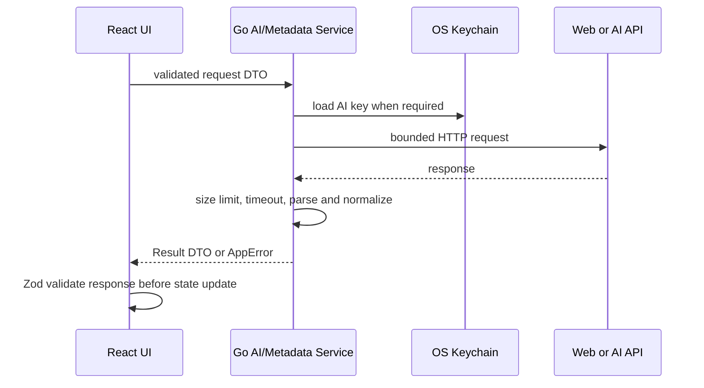

# Linkit 技术设计（Design）

> 文件路径：`docs/spec/design.md`  
> 版本：1.3.0
> 日期：2026-07-19
> 状态：已定稿

---

## 1. 设计目标与边界

本设计用于实现 `docs/spec/requirements.md` 1.5.0 定义的 Linkit MVP。总体目标如下：

- 将现有 Vite + React 演示原型迁移为可交付的 Wails v2 桌面应用。
- 保留现有三栏布局与主要视觉资产，但拆分巨型组件和直接状态修改逻辑。
- 让本地与云端使用同一种版本化资料库文档格式。
- 通过统一 Repository 接口隔离本地文件与 Supabase JSONB 存储。
- 将文件、密钥、网页请求、AI 和链接健康等高权限能力限制在 Go 进程内。
- 所有外部数据进入领域状态前必须经过运行时校验。
- 不实现实时多设备协作、三方合并、pgvector 或公网新链接推荐。

数据库字段与迁移详见 `docs/spec/data.md`；Go/Wails、Supabase 和外部 AI 接口详见 `docs/spec/api.md`。

---

## 2. 项目结构

```text
collection/
├── main.go                         # Wails 启动入口
├── wails.json                      # Wails 构建与前端目录配置
├── go.mod
├── go.sum
├── config/                         # Go 端集中配置与默认值
│   ├── app.go
│   ├── network.go
│   └── storage.go
├── internal/
│   ├── app/                        # Wails 生命周期与服务装配
│   ├── contract/                   # 暴露给前端的 DTO 与错误结构
│   ├── localstore/                 # AppData JSON 原子读写与备份恢复
│   ├── settingsstore/              # AppSettings 与 AI 授权状态持久化
│   ├── secretstore/                # Windows Credential Manager/macOS Keychain 适配
│   ├── metadata/                   # 网页元数据抓取与安全解析
│   ├── health/                     # 手动链接健康扫描
│   ├── ai/                         # OpenAI-compatible 请求与响应归一化
│   └── platform/                   # 文件对话框、外部浏览器、系统路径
├── ui/                             # 现有 React 原型迁移后的 Wails 前端
│   ├── src/
│   │   ├── app/                    # 应用装配、路由门与全局快捷键
│   │   ├── config/                 # 前端集中配置、事件名与常量
│   │   ├── domain/                 # Zod Schema、类型与纯领域命令
│   │   ├── repositories/           # LibraryRepository 及本地/云实现
│   │   ├── services/               # 存储协调、同步、AI、导入导出
│   │   ├── store/                  # Zustand slices 与 selector
│   │   ├── features/               # 按能力拆分的 UI 与交互
│   │   │   ├── auth/
│   │   │   ├── bookmarks/
│   │   │   ├── categories/
│   │   │   ├── collections/
│   │   │   ├── tags/
│   │   │   ├── search/
│   │   │   ├── insights/
│   │   │   ├── health/
│   │   │   └── settings/
│   │   ├── components/             # 无业务状态的可复用组件
│   │   └── i18n/                   # en/zh 词典与错误键
│   ├── wailsjs/                    # Wails 自动生成绑定，不手工编辑
│   └── tests/
├── supabase/
│   └── migrations/                 # 云端表、RLS、revision 迁移
└── docs/spec/                       # SDD 规格与验收证据
```

迁移原则：先保持 `ui/` 可独立运行，再接入 Wails；`ui/src/App.tsx`、`ContentArea.tsx`、`Dialogs.tsx` 等大文件按 feature 逐步拆分，不进行无测试保护的一次性重写。

---

## 3. 架构概览



### 3.1 职责边界

| 层 | 职责 | 禁止事项 |
|----|------|----------|
| React Feature UI | 渲染、用户输入、无障碍交互、对话框 | 直接操作持久化、直接拼装外部 API 请求 |
| Zustand Store | 会话、资料库、UI、同步和设置状态 | 在组件外复制业务规则、持久化密钥 |
| Domain | 纯函数、实体关系、排序筛选、校验与迁移 | 访问网络、文件系统或浏览器存储 |
| Repository | 统一加载、保存和版本冲突接口 | 泄露 Supabase/Wails 具体返回结构给 UI |
| Go Services | 文件、设置、密钥、HTTP、AI、原生系统能力 | 保存临时 React UI 状态、绕过用户确认修改资料库 |
| Supabase | 认证、单用户云文档、RLS | 保存 AI API Key、使用 Service Role Key 访问客户端数据 |

---

## 4. 核心数据流

### 4.1 启动与资料库加载



### 4.2 领域修改与保存



### 4.3 AI 与网页能力



---

## 5. 技术选型

| 领域 | 选型 | 理由 |
|------|------|------|
| 桌面框架 | Wails v2 稳定线 | 满足 Go + React、Windows/macOS 打包和原生能力要求；避免采用仍含 alpha 依赖的 v3 线路 |
| Go↔前端接口 | Wails 自动生成 TypeScript bindings | 公开 Go 方法返回 Promise 和生成模型，减少手写桥接协议 |
| 前端 | React 18.3.1 + TypeScript 5.5.3 | 复用现有原型并遵循已定稿宪法 |
| 构建 | Vite 5.4.2 | 复用现有配置，支持独立 UI 开发与 Wails 构建 |
| 状态管理 | Zustand 5.0.12，slices + selector | 将资料库、同步、会话和 UI 状态模块化，避免 `App.tsx` 集中状态和无关组件重渲染 |
| 运行时校验 | Zod 4.0.1 | 校验导入 JSON、云 JSONB、Wails DTO 与 AI 响应，并支持版本化 Schema |
| 大列表渲染 | `@tanstack/react-virtual` 稳定版 | 在 10,000 个书签基线下限制实际 DOM 节点数量，支撑列表和聚合视图性能预算 |
| 云端 | Supabase Auth + PostgREST + RLS | 现有原型和需求已锁定；浏览器端 publishable key 在正确 RLS 下可安全使用 |
| 云数据模型 | 单用户单行版本化 JSONB | 与需求、导入导出和本地 JSON 保持同构，降低 MVP 同步复杂度 |
| 本地数据 | AppData 版本化 JSON + 原子替换 + `.bak` | 不依赖 WebView 存储，跨平台可控，并与云端及导出格式保持一致 |
| 密钥存储 | Go `SecretStore` + OS Keychain 适配 | AI Key 不进入 React 状态持久化、云同步、导出文件或日志 |
| AI | Go HTTP 适配器调用 OpenAI-compatible Chat API | 避免 WebView CORS 和密钥暴露，统一超时、错误与响应校验 |
| 语义搜索 | 本地候选筛选 + AI 重排 | 满足真实 AI 语义能力，同时避免 MVP 引入 embeddings/pgvector |
| 网页解析 | Go `net/http` + `golang.org/x/net/html` | 不执行页面脚本，以受限请求提取基础元数据 |
| 拖拽 | `@dnd-kit/core` + sortable 能力 | 支持分类树和书签拖拽，并提供比原生拖拽更一致的键盘与触控抽象 |
| i18n | i18next + react-i18next | 支持 `en` 默认、`zh` 切换、稳定键与英文回退 |
| 静态知识图 | React SVG 确定性径向布局 | 需求不要求力导向编辑，避免引入大型图可视化依赖 |
| ORM | 不使用 | 本地无关系数据库；云端仅通过 Supabase 客户端访问单表文档 |

所有新增直接依赖在实施任务中必须锁定精确稳定版本；不得使用 alpha、beta 或 rc。

---

## 6. 前端状态与领域设计

### 6.1 Zustand slices

| Slice | 主要状态 | 主要动作 |
|-------|----------|----------|
| `sessionSlice` | auth 状态、用户、初始化状态 | signIn、signUp、signOut、useLocalMode |
| `librarySlice` | canonical LibraryDocument | executeCommand、hydrate、reset、validate |
| `syncSlice` | activeMode、revision、status、conflict | scheduleSave、resolveConflict、retry、switchStorage |
| `uiSlice` | selection、filters、view、panels、dialogs | select、filter、open/close、shortcut actions |
| `settingsSlice` | theme、locale、AI Base/Model、非敏感偏好 | load、update、applyTheme、changeLocale |

组件必须使用细粒度 selector。Store 不使用 Zustand `persist` 保存领域数据；所有持久化必须经过 Repository，以确保校验、备份、revision 和错误处理一致。

### 6.2 领域命令

所有资料库修改通过纯命令执行，例如：

- `createBookmark`
- `updateBookmark`
- `deleteBookmark`
- `updateBookmarkFromEditor`
- `batchMoveBookmarks`
- `batchDeleteBookmarks`
- `moveCategory`
- `deleteCategoryWithPolicy`
- `setBookmarkCollectionMembership`
- `mergeDuplicateBookmarks`
- `applyImportedDocument`

命令统一返回：

```text
CommandResult<T> =
  | { ok: true; value: T; events: DomainEvent[] }
  | { ok: false; error: DomainError }
```

领域命令负责实体引用完整性和不变量；组件不得直接修改 `bookmarks`、`categories`、`collections` 或 `tags` 数组。

### 6.3 书签操作与批量选择

- 卡片悬停操作区与详情面板顶部统一暴露 `Edit`、`Move`、`Delete`，不以点击标题、滚动到底部或隐藏手势作为唯一入口。
- `BookmarkEditorDialog` 统一编辑 URL、标题、描述、备注、分类、标签、主题和阅读状态；Save 前零副作用，URL 复用既有规范化与安全校验。
- `selectedBookmarkIds` 是通用 UI 选择集合，支持选择框、Ctrl/Cmd 切换与 Shift 范围选择；原有“从选择创建主题”复用该集合。
- 批量操作栏固定显示选中数量及 `Move`、`Delete`、`Clear selection`。
- 批量移动和删除由纯领域命令一次校验全部 ID 后再生成新 LibraryData，禁止部分成功；删除同时清理 Collection.bookmarkIds。
- 单项 Move 与批量 Move 复用同一目标分类对话框，并支持 `Uncategorized`（领域值 `null`）。

---

## 7. 存储与同步设计

### 7.1 Repository 接口

`LocalRepository` 和 `CloudRepository` 实现统一接口：

```text
load() -> LibrarySnapshot | Empty
save(document, expectedRevision) -> SaveSuccess | ConflictError | StorageError
replace(document, confirmedRevision?) -> SaveSuccess | StorageError
describe() -> StorageSummary
```

`StorageCoordinator` 是唯一允许切换 Repository 的模块，负责：

- 展示源端与目标端摘要。
- 执行 `Use Target`、`Overwrite Target` 或 `Cancel`。
- 保存期间防止重复请求。
- 检测 revision 冲突并暂停自动保存。
- 在失败时保留当前内存状态和本地恢复副本。

### 7.2 保存策略

- 领域状态修改后在前端防抖调度保存，默认基线为 900ms，具体常量放入 `ui/src/config/`。
- 本地保存由 Go 写临时文件、同步刷新并原子替换正式文件；替换前更新 `.bak`。
- 云模式下每次领域修改先原子更新本机 `cloud-draft.json`，记录 baseRevision 和 dirty 状态；云保存成功后清理 dirty 草稿。
- 云保存使用 `user_id + revision` 条件更新；受影响行数为零时返回冲突，不自动 upsert 覆盖。
- 冲突解决期间自动保存暂停，新修改继续保留在内存草稿中但不得提交云端。
- `Overwrite Cloud` 必须使用用户确认时重新读取的最新 revision 执行一次明确覆盖。

---

## 8. AI、搜索与健康扫描

### 8.1 AI 适配器

Go 端按能力提供独立方法，但共用一个 OpenAI-compatible 客户端、错误映射、超时和重试策略。客户端读取 API Base 与 Model 配置，并从 OS Keychain 获取 API Key。

正式运行不得以模拟结果冒充真实 AI 响应。无 Key、网络失败、超时、限流或响应无效时，返回可识别错误码，前端提供需求规定的手动或关键词降级路径。

首次向某个 API Base 发送收藏内容前，UI 必须展示数据发送说明。授权状态保存在本机 AppSettings 中，并由 Go AIService 在发送前再次校验；API Base 改变后原授权自动失效。

### 8.2 语义搜索

1. 前端使用纯函数在当前资料库按标题、描述、域名、备注和标签生成有限候选集。
2. 仅向 AI 发送候选的最小必要字段和用户查询，不发送 API Key 以外的凭据。
3. AI 返回候选 ID 与相关度顺序；Go 和前端均验证返回 ID 必须属于候选集。
4. AI 失败时回退关键词搜索，不生成虚构相关度。

### 8.3 网页元数据与健康

- 仅接受 `http`/`https` URL。
- 限制重定向次数、响应体大小和请求时长。
- 不执行网页 JavaScript，不下载真实截图。
- 健康扫描仅由用户主动触发；每个 URL 记录检查时间、状态码、内容指纹和归类结果。
- 扫描进度通过 Wails runtime event 报告，用户关闭对话框不等同于伪造完成状态。

### 8.4 性能实现策略

- 10,000 个书签基线下，Card、List、Masonry、Timeline、Tag Aggregation 和 Theme Space 使用虚拟化或分段渲染，禁止一次挂载全部条目。
- 搜索与筛选使用预计算的规范化搜索投影和细粒度 Zustand selector，避免每次按键重建无关结构。
- 大型 JSON 的 Schema 校验、迁移、索引构建和序列化放入 Web Worker，主线程只接收结果和进度。
- AI、抓取、同步和健康扫描在调用异步边界前立即写入 pending 状态，确保 300ms 进度提示预算不依赖网络响应。
- 本地加载优先显示窗口骨架并并行读取设置与资料库；完成校验后一次 hydrate Store，避免逐项渲染抖动。

---

## 9. 安全性

### 9.1 认证与权限

- Supabase Auth 使用 Email/Password 和持久会话。
- 注册返回有效 session 时进入主界面；注册成功但 session 为空时显示 `Check your email` 并停留在认证界面。
- `user_bookmarks` 必须启用 RLS，所有 CRUD 策略限定 `authenticated` 并使用 `(select auth.uid()) = user_id`。
- 未认证 SELECT 接受 Supabase 原生 HTTP 200 空结果；未认证写入必须由权限或 RLS 拒绝。
- `user_id` 必须具有唯一约束或索引；客户端不得使用 Service Role Key。
- 当前 `.env` 指向的 Supabase 项目无法通过 MCP 核验，远程结构验证标记为 `BLOCKED`；在 STEP 6 云任务执行前必须解除。

### 9.2 密钥

- Supabase publishable key 可进入前端构建，但其安全性完全依赖 RLS。
- AI API Key 仅通过 Go `SecretStore` 写入 Windows Credential Manager 或 macOS Keychain。
- 前端仅获得 `configured: true/false`，Go 接口不得返回密钥明文。
- 日志、错误、截图、导出与云文档不得包含密钥和授权头。

### 9.3 网络与内容

- API Base 默认要求 HTTPS；仅 loopback 本地 AI 服务可使用 HTTP，并显示安全提示。
- 禁止 `file:`、`data:`、`javascript:` 等非 HTTP(S) URL。
- 网页响应只作为不可信文本解析，限制大小并丢弃脚本。
- 外部错误统一映射为英文 `AppError.message`，不得展示响应中的敏感头或内部堆栈。

### 9.4 本地文件

- 数据文件写入平台应用数据目录，不写入安装目录或当前工作目录。
- 临时文件和备份文件使用限制性权限；Windows 与 macOS 使用当前用户可访问范围。
- 读取正式文件失败时先验证 `.bak`，恢复前必须向用户说明来源和时间。

---

## 10. 测试工具选型

| 层级 | 框架 |
|------|------|
| Go 单元与集成测试 | Go `testing` / `go test` |
| React 单元测试 | Vitest |
| React 组件测试 | React Testing Library + Vitest |
| 桌面 E2E | Playwright |
| 视觉回归 | Playwright Screenshot |
| Supabase 本地集成 | Supabase CLI + Go/TypeScript 集成测试 |

覆盖率目标、测试金字塔、测试数据与质量门禁将在 STEP 5 的 `test_strategy.md` 定义，本文件不重复规定。

---

## 11. 部署与构建

- 开发模式：Vite 独立 UI 或 `wails dev`。
- 正式构建：`wails build`，Windows 与 macOS 均须保留构建门禁。
- 完整桌面 E2E 与人工旅程在每个发布候选选定一个可用目标平台执行；另一平台不重复完整旅程，以成功构建证明工程兼容性。
- 前端静态资源嵌入 Wails 二进制。
- Supabase migrations 通过 Supabase CLI 在本地环境验证后应用到远程项目。
- 发布产物不得包含 `.env`、AI Key、测试账号或真实用户数据。

---

## 12. 已知风险与缓解

| 风险 | 影响 | 缓解措施 |
|------|------|----------|
| 单行 JSONB 随资料库增大导致整库写入成本增加 | 云保存延迟和流量增加 | MVP 保持整库文档；记录大小指标，达到设计阈值后回退 STEP 3 评估分片或规范化 |
| 多设备同时编辑 | revision 冲突 | 乐观锁、暂停自动保存、用户明确选择，不做自动合并 |
| WebView 与 Go DTO 类型漂移 | 运行时错误 | Wails 生成绑定 + Zod 边界校验 + 契约测试 |
| OpenAI-compatible 服务差异 | 响应不兼容 | Go 适配层归一化、能力检测和结构校验 |
| AI 收藏内容发送缺少知情授权 | 隐私风险 | 按 API Base 保存首次授权，地址变化后重新确认，Go 发送前二次校验 |
| 10,000 条数据导致 DOM、校验或序列化阻塞 | 无法满足本地性能预算 | 虚拟化、搜索投影、Web Worker 与细粒度 selector |
| 当前 Supabase 项目不可访问 | 无法验证远程 RLS 与迁移 | STEP 6 前提供可访问项目或本地 Supabase 环境，无法验证时保持 BLOCKED |
| 原型组件过大 | 修改风险与测试困难 | 按 feature 渐进拆分，所有迁移遵循 TDD，不一次性重写 |

---

## 13. 需求覆盖概览

| 设计模块 | 主要覆盖需求 |
|----------|--------------|
| Auth + Session | REQ-001、REQ-002、REQ-025 |
| Repository + Sync | REQ-003、REQ-004、REQ-005、REQ-026、REQ-027 |
| Bookmark Domain | REQ-006 至 REQ-009 |
| Category/Collection/Tag Domain | REQ-010 至 REQ-014 |
| Views + Search | REQ-015 至 REQ-018、REQ-024、REQ-028 |
| AI Services | REQ-006、REQ-013、REQ-018 至 REQ-021 |
| Insights + Health | REQ-022 |
| Settings + i18n | REQ-019、REQ-023 |

---

## 14. 修订记录

| 版本 | 日期 | 状态 | 说明 |
|------|------|------|------|
| 0.1.0 | 2026-07-16 | 草稿 | 根据宪法 1.0.0、需求 1.1.0、现有 React 原型和已确认架构决策生成 |
| 1.0.0 | 2026-07-16 | 已定稿 | 经用户确认后正式生效 |
| 1.1.0 | 2026-07-16 | 已定稿 | STEP 4 补充注册分支、原生 RLS 行为、AI 授权、性能实现和云草稿恢复 |
| 1.2.0 | 2026-07-16 | 已定稿 | 对齐单平台完整桌面旅程与双平台 Wails 构建门禁，保持 Windows/macOS 产品支持范围不变 |
| 1.3.0 | 2026-07-19 | 已定稿 | 增加统一书签操作入口、编辑对话框与原子批量移动/删除设计 |
