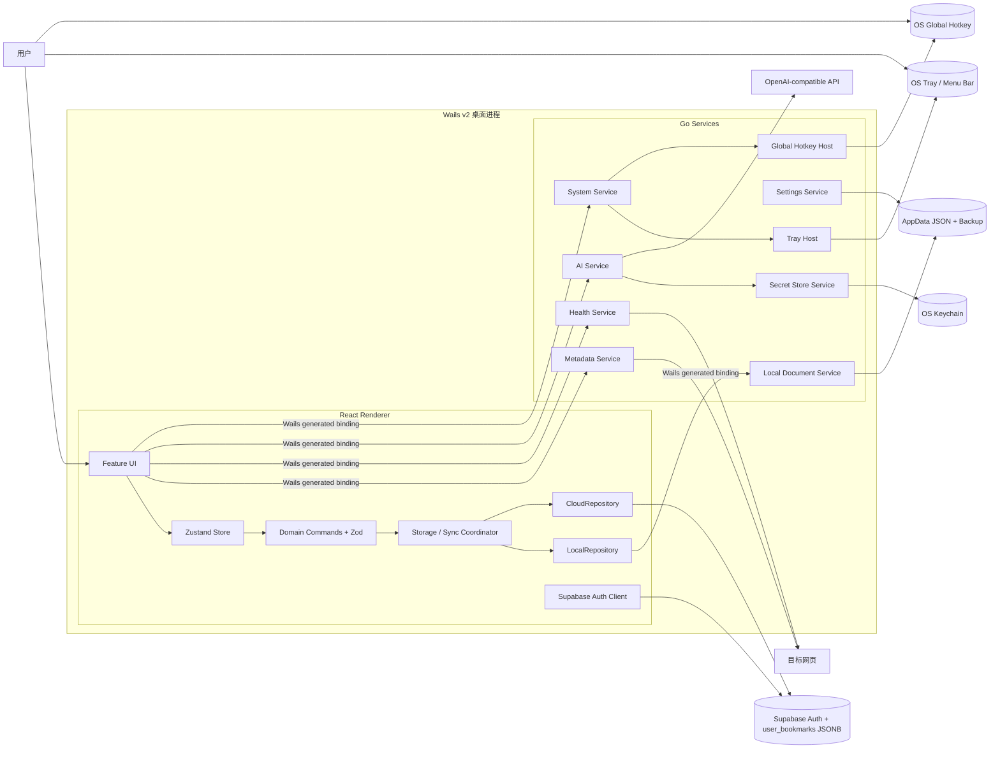
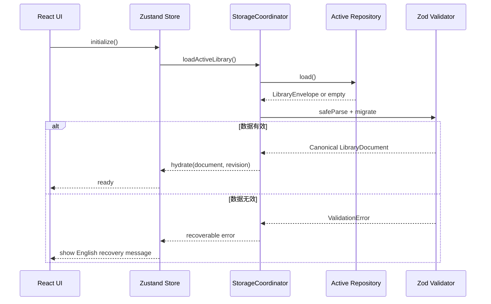
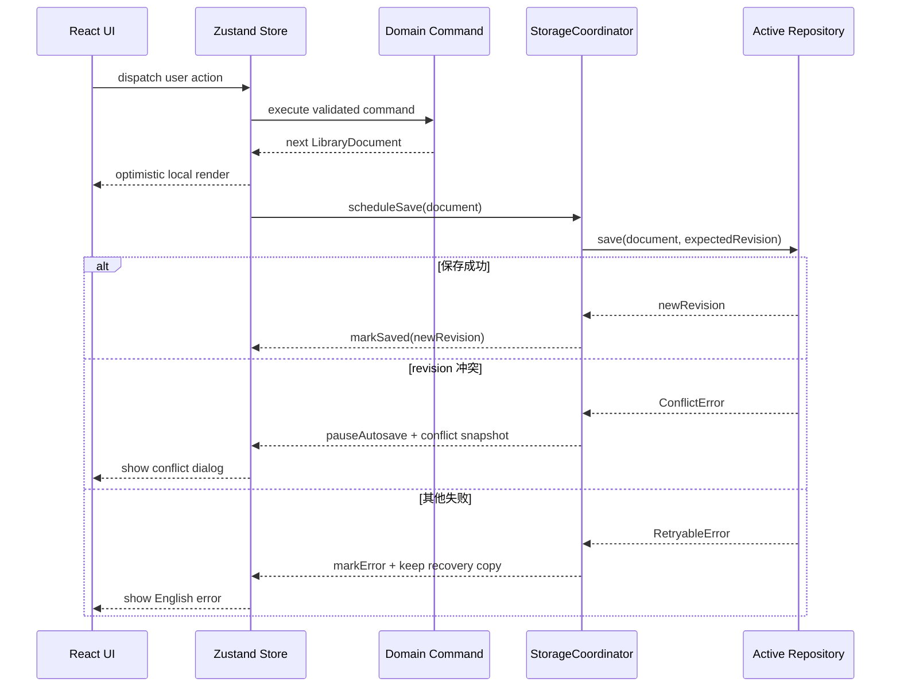
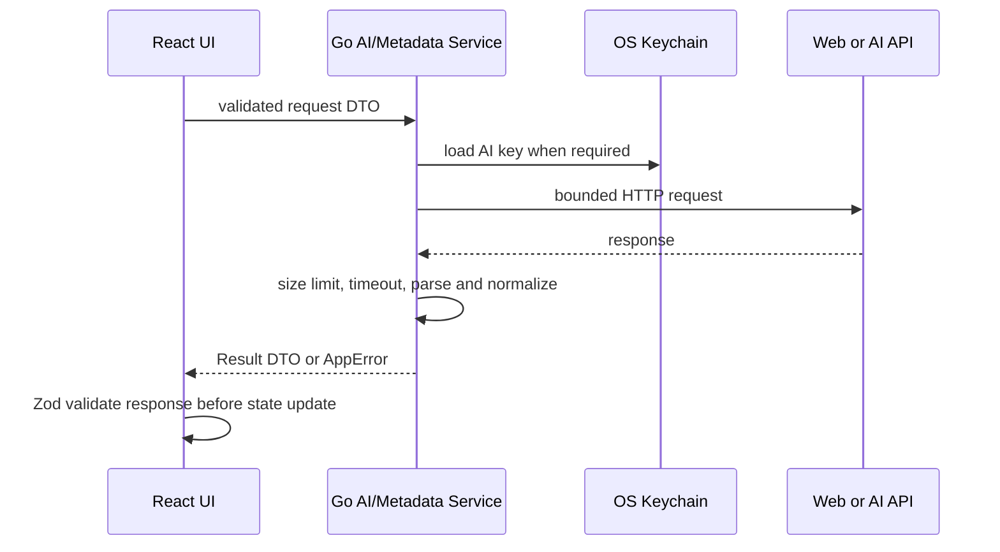
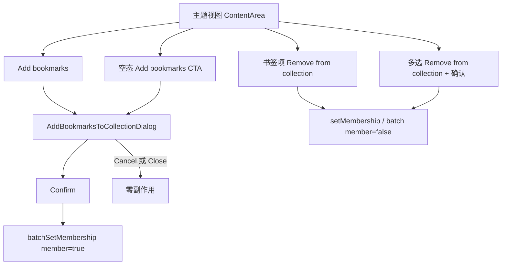
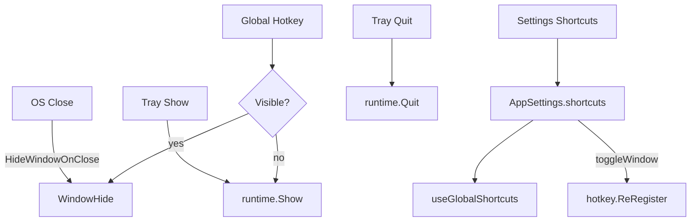
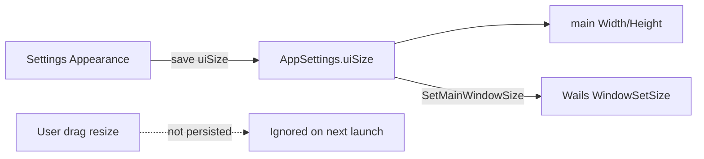

# Linkit 技术设计（Design）

> 文件路径：`docs/spec/design.md`  
> 版本：1.12.0
> 日期：2026-07-22
> 状态：已定稿

---

## 1. 设计目标与边界

本设计用于实现 `docs/spec/requirements.md` 2.5.0 定义的 Linkit MVP。总体目标如下：

- 将现有 Vite + React 演示原型迁移为可交付的 Wails v2 桌面应用。
- 保留现有三栏布局与主要视觉资产，但拆分巨型组件和直接状态修改逻辑。
- 让本地与云端使用同一种版本化资料库文档格式。
- 通过统一 Repository 接口隔离本地文件与 Supabase JSONB 存储。
- 将文件、密钥、网页请求、AI 和链接健康等高权限能力限制在 Go 进程内。
- 所有外部数据进入领域状态前必须经过运行时校验。
- 不实现实时多设备协作、三方合并、pgvector 或公网新链接推荐。

数据库字段与迁移详见 `docs/spec/data.md`；Go/Wails、Supabase 和外部 AI 接口详见 `docs/spec/api.md`。

---

## 2. 项目结构

```text
collection/
├── main.go                         # Wails 启动入口
├── wails.json                      # Wails 构建与前端目录配置
├── go.mod
├── go.sum
├── config/                         # Go 端集中配置与默认值
│   ├── app.go
│   ├── network.go
│   └── storage.go
├── internal/
│   ├── app/                        # Wails 生命周期与服务装配
│   ├── contract/                   # 暴露给前端的 DTO 与错误结构
│   ├── localstore/                 # AppData JSON 原子读写与备份恢复
│   ├── settingsstore/              # AppSettings 与 AI 授权状态持久化
│   ├── secretstore/                # Windows Credential Manager/macOS Keychain 适配
│   ├── metadata/                   # 网页元数据抓取与安全解析
│   ├── health/                     # 手动链接健康扫描
│   ├── ai/                         # OpenAI-compatible 请求与响应归一化
│   ├── platform/                   # 文件对话框、外部浏览器、系统路径
│   ├── tray/                       # 系统托盘/菜单栏图标与 Settings/Quit
│   └── hotkey/                     # 窗口显隐系统级全局热键注册
├── trayicons/                      # Wails 托盘图标资源
├── ui/                             # 现有 React 原型迁移后的 Wails 前端
│   ├── src/
│   │   ├── app/                    # 应用装配、路由门与全局快捷键
│   │   ├── config/                 # 前端集中配置、事件名与常量
│   │   ├── domain/                 # Zod Schema、类型与纯领域命令
│   │   ├── repositories/           # LibraryRepository 及本地/云实现
│   │   ├── services/               # 存储协调、同步、AI、导入导出
│   │   ├── store/                  # Zustand slices 与 selector
│   │   ├── features/               # 按能力拆分的 UI 与交互
│   │   │   ├── auth/
│   │   │   ├── bookmarks/
│   │   │   ├── categories/
│   │   │   ├── collections/
│   │   │   ├── tags/
│   │   │   ├── search/
│   │   │   ├── insights/
│   │   │   ├── health/
│   │   │   ├── shell/              # 主窗口壳、可配置快捷键、Esc/拖入
│   │   │   └── settings/           # Settings 分区含 Shortcuts
│   │   ├── components/             # 无业务状态的可复用组件
│   │   └── i18n/                   # en/zh 词典与错误键
│   ├── wailsjs/                    # Wails 自动生成绑定，不手工编辑
│   └── tests/
├── supabase/
│   └── migrations/                 # 云端表、RLS、revision 迁移
└── docs/spec/                       # SDD 规格与验收证据
```

迁移原则：先保持 `ui/` 可独立运行，再接入 Wails；`ui/src/App.tsx`、`ContentArea.tsx`、`Dialogs.tsx` 等大文件按 feature 逐步拆分，不进行无测试保护的一次性重写。

---

## 3. 架构概览



### 3.1 职责边界

| 层 | 职责 | 禁止事项 |
|----|------|----------|
| React Feature UI | 渲染、用户输入、无障碍交互、对话框 | 直接操作持久化、直接拼装外部 API 请求 |
| Zustand Store | 会话、资料库、UI、同步和设置状态 | 在组件外复制业务规则、持久化密钥 |
| Domain | 纯函数、实体关系、排序筛选、校验与迁移 | 访问网络、文件系统或浏览器存储 |
| Repository | 统一加载、保存和版本冲突接口 | 泄露 Supabase/Wails 具体返回结构给 UI |
| Go Services | 文件、设置、密钥、HTTP、AI、原生系统能力 | 保存临时 React UI 状态、绕过用户确认修改资料库 |
| Supabase | 认证、单用户云文档、RLS | 保存 AI API Key、使用 Service Role Key 访问客户端数据 |

---

## 4. 核心数据流

### 4.1 启动与资料库加载



### 4.2 领域修改与保存



### 4.3 AI 与网页能力



---

## 5. 技术选型

| 领域 | 选型 | 理由 |
|------|------|------|
| 桌面框架 | Wails v2 稳定线 | 满足 Go + React、Windows/macOS 打包和原生能力要求；避免采用仍含 alpha 依赖的 v3 线路 |
| Go↔前端接口 | Wails 自动生成 TypeScript bindings | 公开 Go 方法返回 Promise 和生成模型，减少手写桥接协议 |
| 前端 | React 18.3.1 + TypeScript 5.5.3 | 复用现有原型并遵循已定稿宪法 |
| 构建 | Vite 5.4.2 | 复用现有配置，支持独立 UI 开发与 Wails 构建 |
| 状态管理 | Zustand 5.0.12，slices + selector | 将资料库、同步、会话和 UI 状态模块化，避免 `App.tsx` 集中状态和无关组件重渲染 |
| 运行时校验 | Zod 4.0.1 | 校验导入 JSON、云 JSONB、Wails DTO 与 AI 响应，并支持版本化 Schema |
| 大列表渲染 | `@tanstack/react-virtual` 稳定版 | 在 10,000 个书签基线下限制实际 DOM 节点数量，支撑列表和聚合视图性能预算 |
| 云端 | Supabase Auth + PostgREST + RLS | 现有原型和需求已锁定；浏览器端 publishable key 在正确 RLS 下可安全使用 |
| 云数据模型 | 单用户单行版本化 JSONB | 与需求、导入导出和本地 JSON 保持同构，降低 MVP 同步复杂度 |
| 本地数据 | AppData 版本化 JSON + 原子替换 + `.bak` | 不依赖 WebView 存储，跨平台可控，并与云端及导出格式保持一致 |
| 密钥存储 | Go `SecretStore` + OS Keychain 适配 | AI Key 不进入 React 状态持久化、云同步、导出文件或日志 |
| AI | Go HTTP 适配器调用 OpenAI-compatible Chat API | 避免 WebView CORS 和密钥暴露，统一超时、错误与响应校验 |
| 语义搜索 | 本地候选筛选 + AI 重排 | 满足真实 AI 语义能力，同时避免 MVP 引入 embeddings/pgvector |
| 网页解析 | Go `net/http` + `golang.org/x/net/html` | 不执行页面脚本，以受限请求提取基础元数据 |
| 拖拽 | `@dnd-kit/core` + sortable 能力 | 支持分类树和书签拖拽，并提供比原生拖拽更一致的键盘与触控抽象 |
| i18n | i18next + react-i18next | 支持 `en` 默认、`zh` 切换、稳定键与英文回退 |
| 静态知识图 | React SVG 确定性径向布局 | 需求不要求力导向编辑，避免引入大型图可视化依赖 |
| ORM | 不使用 | 本地无关系数据库；云端仅通过 Supabase 客户端访问单表文档 |

所有新增直接依赖在实施任务中必须锁定精确稳定版本；不得使用 alpha、beta 或 rc。

---

## 6. 前端状态与领域设计

### 6.1 Zustand slices

| Slice | 主要状态 | 主要动作 |
|-------|----------|----------|
| `sessionSlice` | auth 状态、用户、初始化状态 | signIn、signUp、signOut、useLocalMode |
| `librarySlice` | canonical LibraryDocument | executeCommand、hydrate、reset、validate |
| `syncSlice` | activeMode、revision、status、conflict | scheduleSave、resolveConflict、retry、switchStorage |
| `uiSlice` | selection、filters、view、panels、dialogs | select、filter、open/close、shortcut actions |
| `settingsSlice` | theme、locale、AI Base/Model、非敏感偏好 | load、update、applyTheme、changeLocale |

组件必须使用细粒度 selector。Store 不使用 Zustand `persist` 保存领域数据；所有持久化必须经过 Repository，以确保校验、备份、revision 和错误处理一致。

### 6.2 领域命令

所有资料库修改通过纯命令执行，例如：

- `createBookmark`
- `updateBookmark`
- `deleteBookmark`
- `updateBookmarkFromEditor`
- `batchMoveBookmarks`
- `batchDeleteBookmarks`
- `moveCategory`
- `deleteCategoryWithPolicy`
- `setBookmarkCollectionMembership`
- `batchSetBookmarkCollectionMembership`
- `mergeDuplicateBookmarks`
- `applyImportedDocument`

命令统一返回：

```text
CommandResult<T> =
  | { ok: true; value: T; events: DomainEvent[] }
  | { ok: false; error: DomainError }
```

领域命令负责实体引用完整性和不变量；组件不得直接修改 `bookmarks`、`categories`、`collections` 或 `tags` 数组。

#### 6.2.1 分类树展开交互

- `expandedCategories` 仅保存显式展开覆盖值；根分类仍按既有规则默认展开。
- Sidebar 在触发展开切换时把当前实际 `isExpanded` 传回 App，由 App 写入其反值，避免默认展开与状态缺省值语义不一致。
- 仅有子分类的名称绑定双击切换；单击名称继续选择分类，叶子名称双击无展开副作用。
- 现有 Chevron 与名称双击复用同一切换回调；拖拽、悬停操作按钮和领域数据均不改变。

### 6.3 书签操作与批量选择

- 六种书签视图复用 `BookmarkItemActions`，在每个书签项底部统一暴露区别于右侧详情 `Visit` 的 `Open bookmark directly`，以及 `Edit`、`Move`、`Delete`；详情面板顶部保留 `Open bookmark URL` / `Visit` 和相同编辑入口，不使用隐藏手势作为唯一入口。
- 当内容区处于收藏主题视图（`selection.kind === 'collection'`）时，书签项额外暴露 `Remove from collection`；该动作仅解除主题成员关系，不删除书签，立即调用领域命令 `member: false`。
- `BookmarkEditorDialog` 统一编辑 URL、标题、描述、备注、分类、标签、主题和阅读状态；Save 前零副作用，URL 复用既有规范化与安全校验。
- 内容区通过 `Select` / `Done` 显式切换批量选择模式；普通浏览模式不渲染复选框，也不响应 Ctrl/Cmd 或 Shift 批量选择。
- `selectedBookmarkIds` 是选择模式内的通用 UI 选择集合，支持选择框、Ctrl/Cmd 切换与 Shift 范围选择；退出选择模式时清空集合，原有“从选择创建主题”复用该集合。
- 批量操作栏固定显示选中数量及 `Move`、`Delete`、`Clear selection`；主题视图下额外提供 `Remove from collection`，确认前零副作用，确认后经 `batchSetBookmarkCollectionMembership` 一次解除成员关系。
- 批量移动和删除由纯领域命令一次校验全部 ID 后再生成新 LibraryData，禁止部分成功；删除同时清理 Collection.bookmarkIds。
- 单项 Move 与批量 Move 复用同一目标分类对话框，并支持 `Uncategorized`（领域值 `null`）。

### 6.4 主题皮肤与视觉令牌

- `ThemeId` 与 `AppSettingsSchema.theme` 统一支持 `midnight`、`ocean`、`graphite`、`sunset`、`daylight`、`paper` 六个稳定值；扩展枚举不改变设置保存接口和 `settingsVersion`。
- `ui/src/themes.ts` 仅维护主题元数据、预览色板和默认主题；`applyTheme(theme)` 继续只设置根节点 `data-theme` 属性，不承载业务逻辑。
- `ui/tailwind.config.js` 将 `ink`、`accent` 与主题相关阴影映射到 RGB CSS 自定义属性，确保既有 Tailwind 透明度修饰符继续生效。
- `ui/src/index.css` 集中定义六套主题的背景、表面、文字、强调色、描边、阴影、滚动条和焦点令牌；四套深色主题使用 `color-scheme: dark`，Daylight 与 Paper 使用 `color-scheme: light`。
- 组件继续复用既有 `ink-*`、`accent-*`、`glass*`、`hairline` 与阴影工具类，不为单个主题复制组件逻辑或增加主题条件分支。
- 主题变更只影响视觉呈现和外观偏好枚举，不改变收藏、分类、主题组合、同步、AI 或窗口交互功能。

### 6.5 主题视图手动成员管理

覆盖 `REQ-012-AC-006` 至 `REQ-012-AC-011`。不新增数据字段或 Go/Supabase API；全部经现有 Repository 防抖保存。

**模块放置（`ui/src/features/collections/`）**

| 模块 | 职责 |
|------|------|
| `membership-candidates.ts` | 纯函数：从资料库排除当前主题成员；按 title/URL 不区分大小写搜索；维护多选 ID 集合 |
| `AddBookmarksToCollectionDialog.tsx` | 添加书签挑选器；打开期间与 Cancel/关闭路径零副作用 |
| `apply-collection-command.ts`（扩展） | 封装 `runBatchSetMembership`，投影回 UI 实体 |

**领域命令**

- 单条加入/移出继续使用 `setBookmarkCollectionMembership`。
- 批量加入或批量移出使用 `batchSetBookmarkCollectionMembership`：一次校验全部 `bookmarkIds` 与目标 `collectionId`，任一无效则整批失败且资料库不变；成功时返回单一新 `LibraryData`，并保证 `Collection.bookmarkIds` 与 `Bookmark.collectionIds` 双向一致。

**交互流程**



**行为约束**

1. `Add bookmarks` 仅在 `selection.kind === 'collection'` 时显示于内容区工具栏。
2. 挑选器候选仅为非成员书签；支持多选；未选中任何书签时 Confirm 禁用。
3. 确认添加前不调用领域命令；取消或关闭后成员关系不变。
4. 主题成员数为 0 时，空态区显示跟随当前语言的 `Add bookmarks` / `添加书签` CTA，打开与工具栏相同的挑选器；可保留次要「新建书签」入口，但不自动将新建书签归属当前主题。
5. 单条 `Remove from collection` 立即生效；多选移出必须经确认对话框，确认前零副作用。
6. 移出只解除成员关系，书签记录保留在资料库；`Delete` 语义不变。
7. UI 文案使用稳定 i18n key，并由当前设置语言渲染 `Add bookmarks` / `添加书签`、`Remove from collection` / `移出主题` 等系统文本。

**测试工具（仅框架名）**

- 单元 / 组件：Vitest + Testing Library
- E2E / 视觉回归：Playwright

### 6.6 全局界面语言对齐

覆盖 `REQ-023-AC-008`，仅调整前端表现层，不修改领域命令、Repository、持久化文档或 Go/Wails 接口。

- 应用根部由 `I18nProvider` 根据已持久化的 `settings.locale` 提供单一语言上下文；设置对话框继续使用草稿 locale 即时预览，保存后由根 Provider 驱动全部界面刷新。
- React 组件通过统一 `useI18n` Hook 获取类型安全的 `t()`，禁止为相同语言状态增加平行 Store 或组件级硬编码语言条件。
- `ui/src/i18n/catalogs.ts` 是全部系统 UI 文案的唯一词典；English 与中文必须覆盖相同的产品键。English 仍作为未知键和旧版本数据的安全回退。
- 导航、对话框、按钮、表单标签、空态、加载态、状态枚举、Toast、title、placeholder 与 `aria-label` 均使用稳定翻译键；领域枚举值和存储值保持英文稳定值，只在展示层映射。
- 书签标题、描述、URL、分类名、主题名、标签、备注、用户邮箱、AI 生成内容及导入内容属于自定义内容，不传入翻译函数、不改写、不持久化翻译结果。
- Vitest 增加词典完整性、全局 Provider 与组件行为测试；源代码审计测试阻止新增可见硬编码文案。Playwright 覆盖中英文主界面、代表性对话框和无障碍名称，并生成 Baseline、Actual 与 Diff。

### 6.7 关闭隐藏、系统托盘与可配置快捷键

覆盖 `REQ-030` 与修订后的 `REQ-023-AC-001` / `REQ-024` 默认快捷键说明。

#### 关闭与退出

1. 关闭请求经由 `OnBeforeClose`：默认 `HideMainWindow` 并 `prevent=true`；托盘 **Quit** 设置 `allowQuit` 后放行 `runtime.Quit`。不依赖 `HideWindowOnClose`，以便同步可见性状态。
2. 托盘 **Quit** 与平台惯例退出（如 macOS `Cmd+Q`）调用 `QuitApplication`；通过内部 `allowQuit` 标志区分“隐藏”与“真正退出”。
3. 最小化保持 OS 默认行为，不强制进托盘。

#### 系统托盘

1. 使用 Wails v2 `menu.TrayMenu` + `trayicons/` 资源；Windows 通知区、macOS 菜单栏。
2. 菜单固定两项：`Settings`（先 `WindowShow`，再通过 `linkit:open-settings` Wails 事件打开设置对话框）、`Quit`（真正退出）。
3. Linux：best-effort；初始化失败时记录限制并继续运行，验收不得伪造 PASS。
4. 前端通过共享 Wails 事件适配器订阅 `linkit:open-settings`，React 卸载时调用订阅返回的取消函数；浏览器环境缺少 Wails runtime 时安全降级为 no-op。

#### 全局热键与应用内快捷键

1. **窗口显隐**必须走 Go `internal/hotkey` 系统级注册（窗口隐藏时 WebView `keydown` 不可用）；默认 `CmdOrCtrl+L`。
2. 其余快捷键（Spotlight / New / Insights / Settings / 视图 1–3 / 侧栏）由前端 `useGlobalShortcuts` 按 `AppSettings.shortcuts` 生效；Esc 关闭浮层保持固定，不进入可配置集合。
3. **桌面运行时**下 `toggleWindow` 仅由 Go 全局热键处理；前端 `useGlobalShortcuts` 不得再绑定同一 accelerator，避免窗口可见时双触发。浏览器独立 UI 开发模式可提供无副作用的本地显隐模拟，但不得冒充系统级热键验收。
4. 保存显隐绑定后，前端调用 `SystemService.SetToggleWindowHotkey` 重新注册；冲突或平台不支持时返回稳定 `AppError`。

#### Settings → Shortcuts

1. 新增 Shortcuts 分区；列出稳定 action id 与当前绑定。
2. 可配置 action：`spotlight`、`newBookmark`、`insights`、`settings`、`viewCard`、`viewList`、`viewMasonry`、`toggleSidebar`、`toggleWindow`。
3. 绑定存储为跨平台 accelerator 字符串（如 `CmdOrCtrl+K`）；展示层按平台渲染 Ctrl/⌘。
4. 冲突检测为纯函数（同修饰键+主键不可复用）；冲突拒绝保存并显示英文提示。
5. 提供 Restore Defaults；写入本机 `settings.json`，不云同步。



**测试工具（仅框架名）**

- 单元：Go `testing`、Vitest
- E2E：Playwright（Shortcuts 分区与应用内快捷键）
- 托盘/全局热键/OS 关闭：选定平台 Manual（另一平台构建门禁）

### 6.8 Appearance 窗口大小（REQ-031）

Settings → Appearance 在主题选择之外增加 **界面窗口大小** 四档。仅改变原生主窗口宽高，不改变 root font-size、zoom 或控件密度。

#### 档位与预设

| `uiSize` | 英文文案 | 中文文案 | 宽 × 高 |
|----------|----------|----------|---------|
| `small` | Small | 小 | 1152 × 720（相对 Medium ×0.9） |
| `medium` | Medium | 中 | 1280 × 800（默认，与 `config.AppWidth/AppHeight` 一致） |
| `large` | Large | 大 | 1536 × 960 |
| `xlarge` | Extra large | 超大 | 1792 × 1120 |

预设映射集中在 `config/`（Go）与 `ui/src/config/`（TS），两边数值必须一致；禁止在组件内散落魔法数字。

#### 持久化

1. `AppSettings.uiSize` 写入本机 `settings.json`，不云同步。详见 `docs/spec/data.md`。
2. 旧设置缺省字段时，读取层合并为 `medium`，不强制抬升破坏性 `settingsVersion`。
3. **不**单独持久化用户手动拖拽后的宽高；下次启动始终按 `uiSize` 预设打开。

#### 应用时机

1. **冷启动**：`main` 在 `wails.Run` 前通过 `settingsstore` 读取 `uiSize`，将 `options.App.Width/Height` 设为对应预设，避免先以默认尺寸闪一下再缩放。
2. **设置保存**：用户确认保存后，前端调用 `SystemService.SetMainWindowSize`；Go 校验枚举并调用 Wails `runtime.WindowSetSize`。详见 `docs/spec/api.md`。
3. 浏览器独立 UI 模式：无原生窗口时 API 为 no-op，不得冒充桌面尺寸验收。

#### Settings UI

1. Appearance 分区在主题网格下方增加 Window size 选择组（四选一，与主题按钮同风格）。
2. 文案走 `i18n` 词典；语言切换只改标签，不改 `uiSize` 枚举值。
3. 保存流程复用现有 Settings Save；与主题一并提交。



**测试工具（仅框架名）**

- 单元：Go `testing`、Vitest（预设映射、Schema、缺省合并）
- E2E：Playwright（Appearance 四档可发现与文案）
- 原生窗口立即缩放 / 重启恢复：选定平台 Manual 或桌面绑定冒烟

---

## 7. 存储与同步设计

### 7.1 Repository 接口

`LocalRepository` 和 `CloudRepository` 实现统一接口：

```text
load() -> LibrarySnapshot | Empty
save(document, expectedRevision) -> SaveSuccess | ConflictError | StorageError
replace(document, confirmedRevision?) -> SaveSuccess | StorageError
describe() -> StorageSummary
```

`StorageCoordinator` 是唯一允许切换 Repository 的模块，负责：

- 展示源端与目标端摘要。
- 执行 `Use Target`、`Overwrite Target` 或 `Cancel`。
- 保存期间防止重复请求。
- 检测 revision 冲突并暂停自动保存。
- 在失败时保留当前内存状态和本地恢复副本。

### 7.2 保存策略

- 领域状态修改后在前端防抖调度保存，默认基线为 900ms，具体常量放入 `ui/src/config/`。
- 本地保存由 Go 写临时文件、同步刷新并原子替换正式文件；替换前更新 `.bak`。
- 云模式下每次领域修改先原子更新本机 `cloud-draft.json`，记录 baseRevision 和 dirty 状态；云保存成功后清理 dirty 草稿。
- 云保存使用 `user_id + revision` 条件更新；受影响行数为零时返回冲突，不自动 upsert 覆盖。
- 冲突解决期间自动保存暂停，新修改继续保留在内存草稿中但不得提交云端。
- `Overwrite Cloud` 必须使用用户确认时重新读取的最新 revision 执行一次明确覆盖。

### 7.3 本地数据根与目录迁移

本地文件不以硬编码用户目录写入。路径解析顺序：

1. 按构建身份解析平台默认 AppData 下的引导根目录名：正式构建为 `Linkit/`；启用 Go build tag `dev` 的开发构建为 `Linkit-Dev/`。身份常量集中在 `config/identity*.go`。
2. 读取引导根中的 `data-root.json`；若不存在或 `dataRoot` 等于引导根自身，则以引导根为有效数据根。
3. 若 `dataRoot` 指向其他绝对路径，则 library、settings、cloud-draft 及其 `.bak`/`.tmp` 全部读写该路径。
4. `data-root.json` 永远只保留在当前身份的默认 AppData 引导根，不随资料库迁移到目标目录。
5. OS Keychain / Credential Manager 的服务名与引导根目录名一致（正式 `Linkit`，开发 `Linkit-Dev`），避免开发期密钥污染正式安装验证。

`data-root.json` 字段：

| 字段 | 类型 | 说明 |
|------|------|------|
| `format` | string | 固定 `linkit-data-root` |
| `schemaVersion` | integer | `>= 1` |
| `dataRoot` | string | 绝对路径；等于引导根表示未重定向 |
| `updatedAt` | ISO-8601 string | 最近一次成功切换时间 |

目录迁移由 Go `LocalDocumentService`（或同层 DataRoot 协调模块）独占执行，前端只发起选择与确认：

1. UI 调用原生目录选择器拿到候选路径。
2. Go 校验目标可写、且不包含既有 Linkit 数据文件（如 `library.json`、`settings.json`、`data-root.json` 或已知临时/备份文件）。允许目标为当前数据根的子目录或父目录（仅按白名单文件复制/清理，不递归删除目录）。冲突时返回 `DATA_ROOT_TARGET_OCCUPIED`，不得覆盖。
3. 确认前 UI 展示源路径、目标路径与将迁移文件摘要；未确认不得写盘。
4. 确认后：暂停本地/云自动保存；将源数据根中除 `data-root.json` 外的全部应用数据文件复制到目标；校验目标可读且关键文件完整；原子更新引导根 `data-root.json`；删除源数据根中已成功迁走的文件；恢复自动保存并切换后续读写到新根。
5. 任一步失败：保持原 `dataRoot` 与源文件不变，清理本次写入目标的残留，返回英文 `AppError`；不得报告成功。
6. OS Keychain 密钥不参与文件迁移；迁移成功后既有 Key 状态应继续可读。

重置为默认目录时复用同一迁移流程，目标为平台默认引导根，并在成功后将 `dataRoot` 写回引导根自身或删除重定向指针。

---

## 8. AI、搜索与健康扫描

### 8.1 AI 适配器

Go 端按能力提供独立方法，但共用一个 OpenAI-compatible 客户端、错误映射、超时和重试策略。客户端读取 API Base 与 Model 配置，并从 OS Keychain 获取 API Key。

正式运行不得以模拟结果冒充真实 AI 响应。无 Key、网络失败、超时、限流或响应无效时，返回可识别错误码，前端提供需求规定的手动或关键词降级路径。

首次向某个 API Base 发送收藏内容前，UI 必须展示数据发送说明。授权状态保存在本机 AppSettings 中，并由 Go AIService 在发送前再次校验；API Base 改变后原授权自动失效。

### 8.2 语义搜索

1. 前端使用纯函数在当前资料库按标题、描述、域名、备注和标签生成有限候选集。
2. 仅向 AI 发送候选的最小必要字段和用户查询，不发送 API Key 以外的凭据。
3. AI 返回候选 ID 与相关度顺序；Go 和前端均验证返回 ID 必须属于候选集。
4. AI 失败时回退关键词搜索，不生成虚构相关度。

### 8.3 网页元数据与健康

- 仅接受 `http`/`https` URL。
- 限制重定向次数、响应体大小和请求时长。
- 不执行网页 JavaScript，不下载真实截图。
- 健康扫描仅由用户主动触发；每个 URL 记录检查时间、状态码、内容指纹和归类结果。
- 扫描进度通过 Wails runtime event 报告，用户关闭对话框不等同于伪造完成状态。

### 8.4 性能实现策略

- 10,000 个书签基线下，Card、List、Masonry、Timeline、Tag Aggregation 和 Theme Space 使用虚拟化或分段渲染，禁止一次挂载全部条目。
- 搜索与筛选使用预计算的规范化搜索投影和细粒度 Zustand selector，避免每次按键重建无关结构。
- 大型 JSON 的 Schema 校验、迁移、索引构建和序列化放入 Web Worker，主线程只接收结果和进度。
- AI、抓取、同步和健康扫描在调用异步边界前立即写入 pending 状态，确保 300ms 进度提示预算不依赖网络响应。
- 本地加载优先显示窗口骨架并并行读取设置与资料库；完成校验后一次 hydrate Store，避免逐项渲染抖动。

---

## 9. 安全性

### 9.1 认证与权限

- Supabase Auth 使用 Email/Password 和持久会话。
- 注册返回有效 session 时进入主界面；注册成功但 session 为空时显示 `Check your email` 并停留在认证界面。
- `user_bookmarks` 必须启用 RLS，所有 CRUD 策略限定 `authenticated` 并使用 `(select auth.uid()) = user_id`。
- 未认证 SELECT 接受 Supabase 原生 HTTP 200 空结果；未认证写入必须由权限或 RLS 拒绝。
- `user_id` 必须具有唯一约束或索引；客户端不得使用 Service Role Key。
- 当前 `.env` 指向的 Supabase 项目无法通过 MCP 核验，远程结构验证标记为 `BLOCKED`；在 STEP 6 云任务执行前必须解除。

### 9.2 密钥

- Supabase publishable key 可进入前端构建，但其安全性完全依赖 RLS。
- AI API Key 仅通过 Go `SecretStore` 写入 Windows Credential Manager 或 macOS Keychain。
- 前端仅获得 `configured: true/false`，Go 接口不得返回密钥明文。
- 日志、错误、截图、导出与云文档不得包含密钥和授权头。

### 9.3 网络与内容

- API Base 默认要求 HTTPS；仅 loopback 本地 AI 服务可使用 HTTP，并显示安全提示。
- 禁止 `file:`、`data:`、`javascript:` 等非 HTTP(S) URL。
- 网页响应只作为不可信文本解析，限制大小并丢弃脚本。
- 外部错误统一映射为英文 `AppError.message`，不得展示响应中的敏感头或内部堆栈。

### 9.4 本地文件

- 数据文件写入当前有效数据根（默认 AppData 或用户选定目录），不写入安装目录或当前工作目录。
- 默认 AppData 仅保留 `data-root.json` 引导指针；真实 `library.json` / `settings.json` / 云草稿位于有效数据根。
- 临时文件和备份文件使用限制性权限；Windows 与 macOS 使用当前用户可访问范围。
- 读取正式文件失败时先验证 `.bak`，恢复前必须向用户说明来源和时间。
- 更改数据根时必须先确认；目标已占用时阻止迁移；失败时回滚指针并清理目标残留。

---

## 10. 测试工具选型

| 层级 | 框架 |
|------|------|
| Go 单元与集成测试 | Go `testing` / `go test` |
| React 单元测试 | Vitest |
| React 组件测试 | React Testing Library + Vitest |
| 桌面 E2E | Playwright |
| 视觉回归 | Playwright Screenshot |
| Supabase 本地集成 | Supabase CLI + Go/TypeScript 集成测试 |

覆盖率目标、测试金字塔、测试数据与质量门禁将在 STEP 5 的 `test_strategy.md` 定义，本文件不重复规定。

---

## 11. 部署与构建

- 开发模式：Vite 独立 UI，或 `scripts/dev.ps1` / `scripts/dev.sh`（`wails dev -tags dev`），使用 `Linkit-Dev` 身份槽。
- 正式构建：`wails build`（**不加** `dev` tag），Windows / macOS / Linux CI Release 均须保留构建门禁，并使用 `Linkit` 正式身份。
- 完整桌面 E2E 与人工旅程在每个发布候选选定一个可用目标平台执行；另一平台不重复完整旅程，以成功构建证明工程兼容性。
- 前端静态资源嵌入 Wails 二进制；嵌入内容仅为 `frontend/dist` UI 资源，不得嵌入用户 AppData 或密钥。
- Supabase migrations 通过 Supabase CLI 在本地环境验证后应用到远程项目。
- 发布产物不得包含 `.env`、AI Key、测试账号、真实用户数据，或开发身份字符串 `Linkit-Dev`。
- Release 流水线须校验正式身份常量，并扫描产物不包含 `Linkit-Dev`。

---

## 12. 已知风险与缓解

| 风险 | 影响 | 缓解措施 |
|------|------|----------|
| 单行 JSONB 随资料库增大导致整库写入成本增加 | 云保存延迟和流量增加 | MVP 保持整库文档；记录大小指标，达到设计阈值后回退 STEP 3 评估分片或规范化 |
| 多设备同时编辑 | revision 冲突 | 乐观锁、暂停自动保存、用户明确选择，不做自动合并 |
| WebView 与 Go DTO 类型漂移 | 运行时错误 | Wails 生成绑定 + Zod 边界校验 + 契约测试 |
| OpenAI-compatible 服务差异 | 响应不兼容 | Go 适配层归一化、能力检测和结构校验 |
| AI 收藏内容发送缺少知情授权 | 隐私风险 | 按 API Base 保存首次授权，地址变化后重新确认，Go 发送前二次校验 |
| 10,000 条数据导致 DOM、校验或序列化阻塞 | 无法满足本地性能预算 | 虚拟化、搜索投影、Web Worker 与细粒度 selector |
| 当前 Supabase 项目不可访问 | 无法验证远程 RLS 与迁移 | STEP 6 前提供可访问项目或本地 Supabase 环境，无法验证时保持 BLOCKED |
| 原型组件过大 | 修改风险与测试困难 | 按 feature 渐进拆分，所有迁移遵循 TDD，不一次性重写 |
| 自定义数据根迁移中断或目标冲突 | 资料库不可用或静默覆盖 | 引导根指针原子切换；冲突阻止；失败清理目标残留并保持原根 |
| 开发与正式构建共用本机身份槽 | 本机验证 Release 误读开发测试数据/AI 配置 | 用 build tag `dev` 隔离 `Linkit-Dev`；Release CI 断言正式身份且扫描产物不含开发身份字符串 |

---

## 13. 需求覆盖概览

| 设计模块 | 主要覆盖需求 |
|----------|--------------|
| Auth + Session | REQ-001、REQ-002、REQ-025 |
| Repository + Sync | REQ-003、REQ-004、REQ-005、REQ-026、REQ-027、REQ-029 |
| Bookmark Domain | REQ-006 至 REQ-009 |
| Category/Collection/Tag Domain | REQ-010 至 REQ-014 |
| Views + Search | REQ-015 至 REQ-018、REQ-024、REQ-028 |
| AI Services | REQ-006、REQ-013、REQ-018 至 REQ-021 |
| Insights + Health | REQ-022 |
| Settings + i18n + Theme Tokens | REQ-019、REQ-023、REQ-028、REQ-029、REQ-031 |
| Tray + Global Hotkey + Shortcuts | REQ-030、REQ-023、REQ-024、REQ-027 |
| Appearance Window Size | REQ-031 |

---

## 14. 修订记录

| 版本 | 日期 | 状态 | 说明 |
|------|------|------|------|
| 0.1.0 | 2026-07-16 | 草稿 | 根据宪法 1.0.0、需求 1.1.0、现有 React 原型和已确认架构决策生成 |
| 1.0.0 | 2026-07-16 | 已定稿 | 经用户确认后正式生效 |
| 1.1.0 | 2026-07-16 | 已定稿 | STEP 4 补充注册分支、原生 RLS 行为、AI 授权、性能实现和云草稿恢复 |
| 1.2.0 | 2026-07-16 | 已定稿 | 对齐单平台完整桌面旅程与双平台 Wails 构建门禁，保持 Windows/macOS 产品支持范围不变 |
| 1.3.0 | 2026-07-19 | 已定稿 | 增加统一书签操作入口、编辑对话框与原子批量移动/删除设计 |
| 1.4.0 | 2026-07-19 | 已定稿 | 增加六主题视觉令牌架构，引入 Daylight 与 Paper，并约束主题变更不得进入业务逻辑 |
| 1.8.0 | 2026-07-20 | 已定稿 | 增加全局 I18nProvider、完整系统词典、展示层枚举映射与自定义内容排除边界，对齐 REQ-023-AC-008 |
| 1.5.0 | 2026-07-19 | 已定稿 | 新增本地数据根引导指针与目录迁移设计，覆盖 REQ-029 |
| 1.6.0 | 2026-07-19 | 已定稿 | 新增 6.5 主题视图手动成员管理；引入 batchSetBookmarkCollectionMembership；对齐 REQ-012-AC-006~011 |
| 1.7.0 | 2026-07-20 | 已定稿 | 开发/正式身份槽隔离（Linkit vs Linkit-Dev）；对齐 REQ-025-AC-006 与发布构建门禁 |
| 1.9.0 | 2026-07-21 | 已定稿 | 新增 6.7：HideWindowOnClose、托盘 Show/Quit、系统级显隐热键、Settings→Shortcuts；对齐 REQ-030 |
| 1.10.0 | 2026-07-21 | 已定稿 | 新增 6.8：Appearance 窗口大小四档、启动读预设、SetMainWindowSize；对齐 REQ-031 |
| 1.11.0 | 2026-07-22 | 已定稿 | 托盘第一项由 Show 改为 Settings，并增加 Go→React 的 Wails 设置事件桥接；Quit 设计保持不变 |
| 1.12.0 | 2026-07-22 | 已定稿 | 分类树切换改用当前实际展开值；增加分类名称双击入口并保持单击、Chevron 与拖拽行为 |
