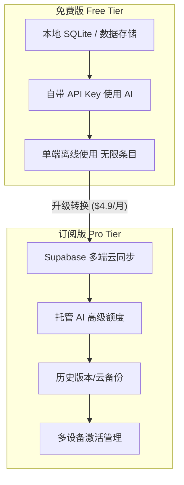
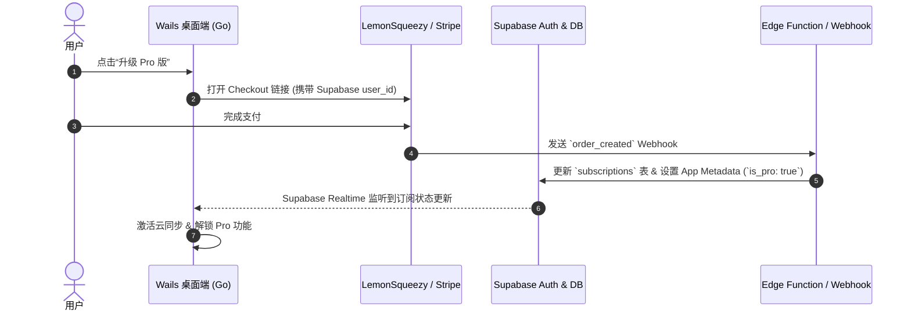
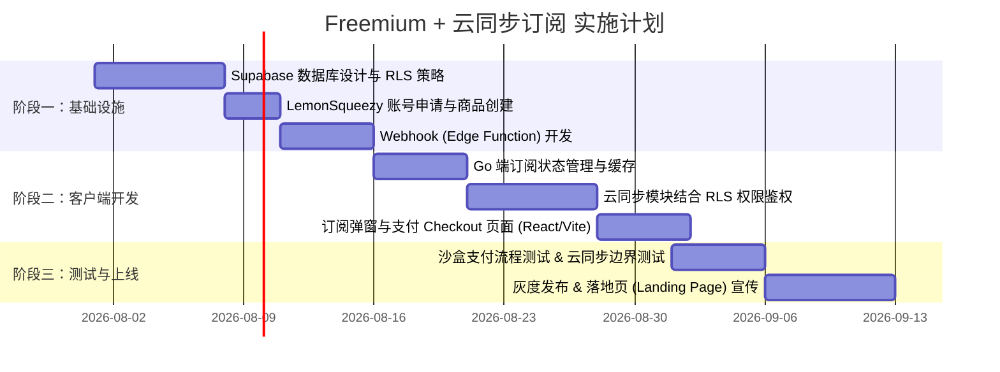

# Collection 商业模式方案：Freemium + 云同步订阅

---

## 一、 商业模式核心逻辑

对于基于 Wails/Go 打造的桌面端应用，**“本地优先 (Local-First) + 云端增值 (Cloud Value-Add)”** 是当前独立开发者最推荐的变现路径。



### 1. 核心价值锚定
* **对用户的承诺**：应用即便停止维护或断网，免费用户的本地数据永远属于自己且完全可用（消弭用户对订阅制“不给钱就无法查看自己数据”的顾虑）。
* **商业化的抓手**：多设备同步（跨 Mac/Win/Linux 或未来移动端）、云端容灾备份、免配置开箱即用的托管 AI 算力。

---

## 二、 功能分级与权益矩阵 (Feature Tiering)

| 功能维 (Feature Area) | 免费版 (Free Tier) | 专业版 (Pro Tier - $4.9/月 或 $39/年) | 商业逻辑与设计考量 |
| :--- | :--- | :--- | :--- |
| **本地数据存储** | ✅ **无限** | ✅ **无限** | 保证 Local-First 体验，建立口碑 |
| **Supabase 云同步** | ❌ 仅本地存储 | ✅ **实时多端同步** | **核心变现点**：解决多设备数据打通需求 |
| **多设备管理** | 1 台设备 | ✅ **最多 5 台设备** | 防止账号无限 shared |
| **AI 模块 (自带 Key)** | ✅ **无限制** (BYOK) | ✅ **无限制** (BYOK) | 不增加开发者计算与 Token 成本 |
| **AI 模块 (托管算力)** | ⚠️ 每日 10 次试用 | ✅ **每月 500 万 Token** | 开箱即用体验，对懒人/非技术用户变现 |
| **云端自动备份** | ❌ 仅支持手动导出 | ✅ **每日自动快照 (保留30天)** | 数据安全焦虑转化 |
| **客服支持** | GitHub Issues 社区 | ✅ **优先 Email 支持** | 提升付费用户留存 |

---

## 三、 系统架构与工程实现方案

### 1. 订阅与鉴权流程架构



### 2. 数据库设计 (Supabase SQL)

#### (1) 订阅状态表 (`user_subscriptions`)
```sql
create type subscription_status as enum ('active', 'canceled', 'past_due', 'trailing');

create table public.user_subscriptions (
    id uuid primary key default gen_random_uuid(),
    user_id uuid references auth.users(id) on delete cascade unique not null,
    stripe_customer_id text,
    subscription_id text unique,
    variant_id text, -- 套餐类型（月付/年付）
    status subscription_status default 'canceled',
    current_period_end timestamptz not null,
    created_at timestamptz default now(),
    updated_at timestamptz default now()
);

-- 开启 RLS 保证安全性
alter table public.user_subscriptions enable row level security;

create policy "用户仅能查看自己的订阅状态" 
on public.user_subscriptions for select 
using (auth.uid() = user_id);
```

#### (2) 依赖 RLS 的数据同步隔离 (以 `collections` 表为例)
即便攻击者通过开源客户端代码修改了本地校验，Supabase 数据库层的 RLS 会严格拒绝非 Pro 用户的同步写/读请求：

```sql
create policy "只有 Pro 用户才能进行云端同步"
on public.collections for all
using (
    auth.uid() = user_id 
    and 
    exists (
        select 1 from public.user_subscriptions 
        where user_id = auth.uid() 
          and status = 'active' 
          and current_period_end > now()
    )
);
```

### 3. Wails (Go 端) 订阅鉴权模块逻辑

在 Go 后端模块封装订阅校验机制，防止前端 UI 被恶意破解：

```go
// internal/subscription/service.go
package subscription

import (
	"context"
	"time"
)

type SubscriptionInfo struct {
	IsPro            bool      `json:"isPro"`
	Status           string    `json:"status"`
	CurrentPeriodEnd time.Time `json:"currentPeriodEnd"`
}

type Service struct {
	// Supabase Client 依赖
}

func (s *Service) CheckEntitlement(ctx context.Context, userID string) (*SubscriptionInfo, error) {
	// 1. 先查本地加密缓存的 Token 签名（支持短期离线验权）
	// 2. 联网情况下请求 Supabase API 校验订阅有效性
	// 3. 返回包含权限标志的结构体
	return &SubscriptionInfo{
		IsPro: true,
	}, nil
}
```

---

## 四、 支付与代扣代缴选型：LemonSqueezy vs Stripe

推荐选择 **LemonSqueezy** 或 **Paddle** 作为 MoR (Merchant of Record，记录商家)，而非裸连 Stripe：

| 维度 | LemonSqueezy / Paddle (推荐 ⭐⭐⭐⭐⭐) | 直接集成 Stripe |
| :--- | :--- | :--- |
| **税务合规 (VAT/GST)** | **自动处理全球合规与代扣代缴** | 开发者需自行在各国/地区申报税务 |
| **结算支付方式** | 支持 Credit Cards, Apple Pay, PayPal, Google Pay | 需自行配置多个支付渠道 |
| **对接难度** | 提供现成 SDK 和 SDK 外弹出式 Checkout | 需开发较多前端支付逻辑 |
| **手续费** | 约 5% + $0.50 / 单 | 约 2.9% + $0.30 / 单 |

> **建议**：独立开发者首选 **LemonSqueezy**，多出的约 2% 手续费能为你节省大量的全球税务清算风险与法务成本。

---

## 五、 成本控制与开源反破解策略

### 1. 成本控制 (Cost Control)
* **Supabase 费用优化**：
  * 使用 Supabase 免费额度（500MB DB, 50,000 月活用户）冷启动。
  * 当付费用户增多时，利用付费订阅收入升级至 Pro Plan ($25/月)。
  * **图片/文件处理**：避免将大文件直接写数据库，桌面端在同步前将图片压缩或转换为 WebP，限制单张图片最大 1MB。
* **托管 AI 成本限制**：
  * 使用 Supabase Edge Function 作为 AI 请求代理层。
  * 在 Edge Function 内集成 Redis / Supabase Table 进行用户每日/每月 Token 消费的 Rate Limiting。

### 2. 开源项目的防破解策略
因为你的核心客户端代码是开源的（Wails/Go），必须保证**商业逻辑安全在服务端，而非客户端**：

1. **服务端为真实屏障**：
   * 客户端就算被重写/解除 `if (!isPro)` 逻辑，没有有效 JWT/Session，Supabase REST API/Realtime 也会拒绝数据同步。
2. **开源代码架构隔离**：
   * 将核心的数据同步逻辑模块（Sync Engine）与云端对接协议抽象成 Interface，开源客户端保留标准接口，云同步服务通过插件/编译标记接入。
3. **自带 Key 免费**：
   * 倡导“自带 API Key 免费使用”，降低用户破解动机，提供合法的免费高级用法。

---

## 六、 实施路线图 (Implementation Roadmap)



### 具体行动点 (Action Items)：
1. **构建 Landing Page**：突出“本地安全存储”与“云同步”的对比。
2. **集成 LemonSqueezy**：在 React 前端接入 `LemonSqueezy.Url.Open()` 打开支付弹窗。
3. **多设备鉴权设计**：桌面端首次登录时生成唯一 `device_id` 并录入 Supabase，超额设备限制同步。

---

## 七、 总结与建议

1. **定价建议**：
   * 月付：**$4.99 / 月**
   * 年付：**$39.99 / 年** (折合 $3.33/月，相当于 6.6 折，鼓励年付以锁定现金流)
2. **转化率预测**：
   * 按照行业惯例，Tool/Utility 类开源桌面应用从免费用户到付费订阅的转换率通常在 **1.5% - 3.5%**。
   * 当获得 10,000 个活跃免费用户时，预计可实现约 **200~300 付费订阅**，实现每月 **$1,000+ MRR (月重复收入)**，足以覆盖 Supabase 及其他服务器开支并产生盈利。
